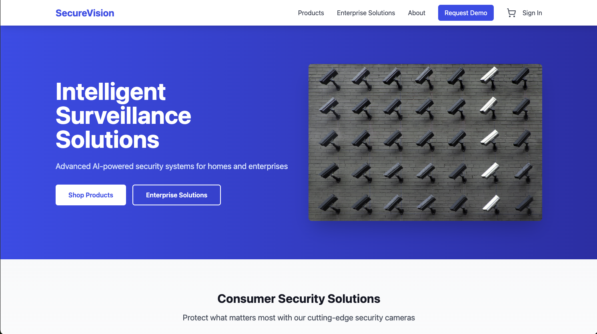
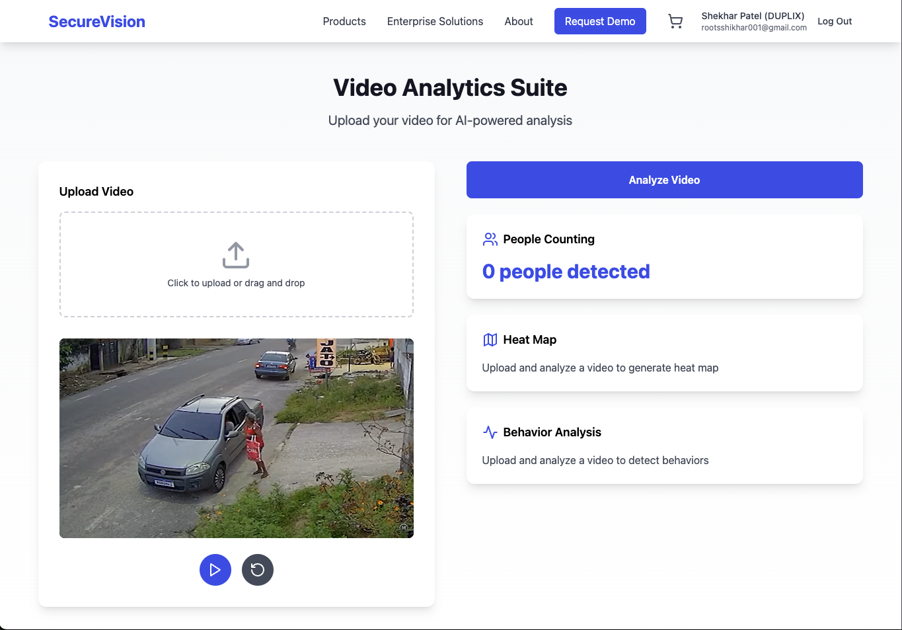
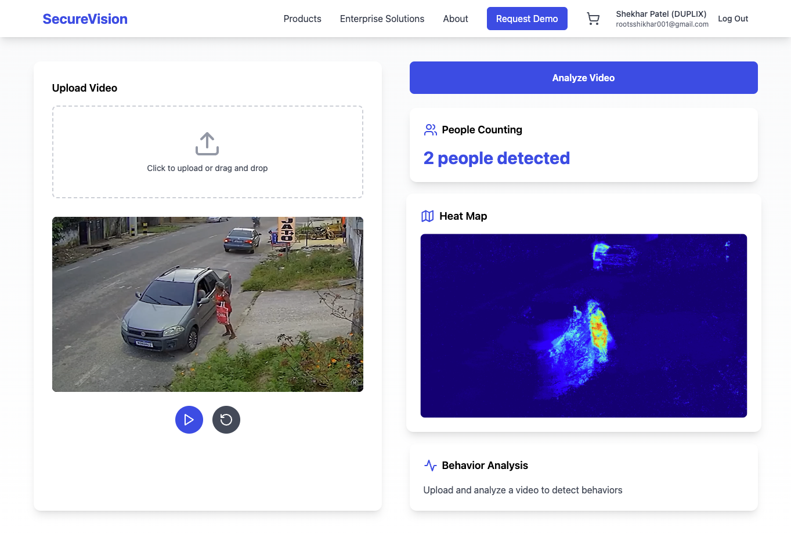

# CCTV MarketPlace


## AI Features
#### Real-Time Analytics
 - People counting and tracking
 - Movement pattern analysis
 - Behavior detection
 - Heat map generation for traffic flow
## Before & After Analysis ↓


After

## Overview

CCTV MarketPlace is an innovative e-commerce platform combining traditional CCTV equipment sales with cutting-edge AI analysis capabilities. The platform leverages computer vision and machine learning to provide intelligent security solutions.

## Project Requirements

### Use Cases

1. **Direct-to-Consumer (D2C)**
    - Product catalogue
    - Company story
    - Subscription plans
    - Reference: [Tapo](https://www.tapo.com/in/)

2. **Business-to-Business (B2B)**
    - Service lines and software solutions
    - "Request demo" and "Contact sales" buttons
    - Services listed with features
    - Focus on existing client base
    - Reference: [RealCoderz](https://realcoderz.com/)

## Tech Stack

### Frontend
- **React**: A JavaScript library for building user interfaces.
- **Redux**: A state management library for JavaScript apps.
- **TypeScript**: A superset of JavaScript that adds static types.
- **Tailwind CSS**: A utility-first CSS framework for rapid UI development.
- **Vite**: A build tool that provides a fast development environment.

### Backend
- **FastAPI**: A modern, fast web framework for building APIs with Python 3.7+.
- **OpenCV**: for video processing
- **MongoDB**: A NoSQL database known for its flexibility and scalability.
- **Uvicorn**: A lightning-fast ASGI server implementation.


## Getting Started

### Prerequisites

- Node.js
- Python 3.7+
- MongoDB

### Installation

1. Clone the repository:
    ```sh
    git clone https://github.com/yourusername/cctv-marketplace.git
    cd cctv-marketplace
    ```

2. Install frontend dependencies:
    ```sh
    npm install
    ```

3. Install backend dependencies:
    ```sh
    cd backend
    pip install -r requirements.txt
    ```

### Running the Application

1. Start the backend server:
    ```sh
    cd backend
    uvicorn app.main:app --reload
    ```

2. Start the frontend development server:
    ```sh
    npm run dev
    ```

3. Open your browser and navigate to `http://localhost:5173/`.

## License

This project is licensed under the MIT License.